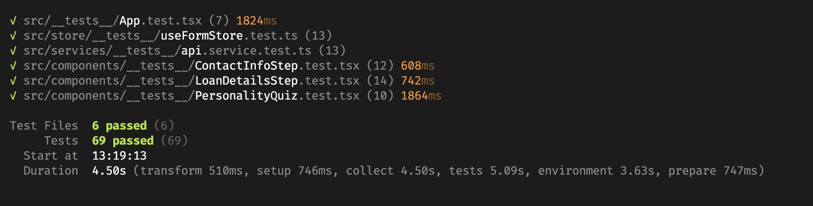

# Ume Loans — Multi‑step Lead Form

Live: <a href="https://ume-loan-app.vercel.app/" target="_blank" rel="noopener noreferrer">ume-loan-app.vercel.app</a>

## Testing
- Tests are written with Vitest and React Testing Library.
- Passing test run:



Modern, production‑style multi‑step loan application built with React + TypeScript The flow guides users through a short quiz, loan details, contact info, and a success screen.

## Features
- Multi‑step form with animated transitions
- Loan amount slider with real‑time monthly estimate
- Form validation (React Hook Form + Zod)
- Auto‑save to localStorage and session restore
- In‑browser mock API (MSW) simulating lead + account creation

## Quick Start
```bash
npm install
npm run dev          # start locally
npm test             # unit tests
npm run build        # production build
npm run preview      # preview build locally
```

## Tech Stack
- React + TypeScript
- Tailwind CSS
- Framer Motion
- React Hook Form, Zod
- Axios
- Vitest + React Testing Library (jsdom)
- MSW (Mock Service Worker)


## Mock API
The app uses MSW to simulate standard REST endpoints under `/api/*` for this demo. No setup is required to run the project locally.

## Deployment
Deployed to Vercel. The repo includes `vercel.json` for headers and rewrites. To preview a local production build use `npm run preview` after `npm run build`.